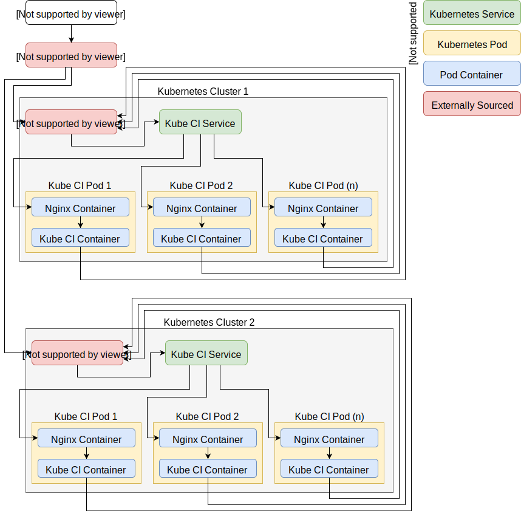
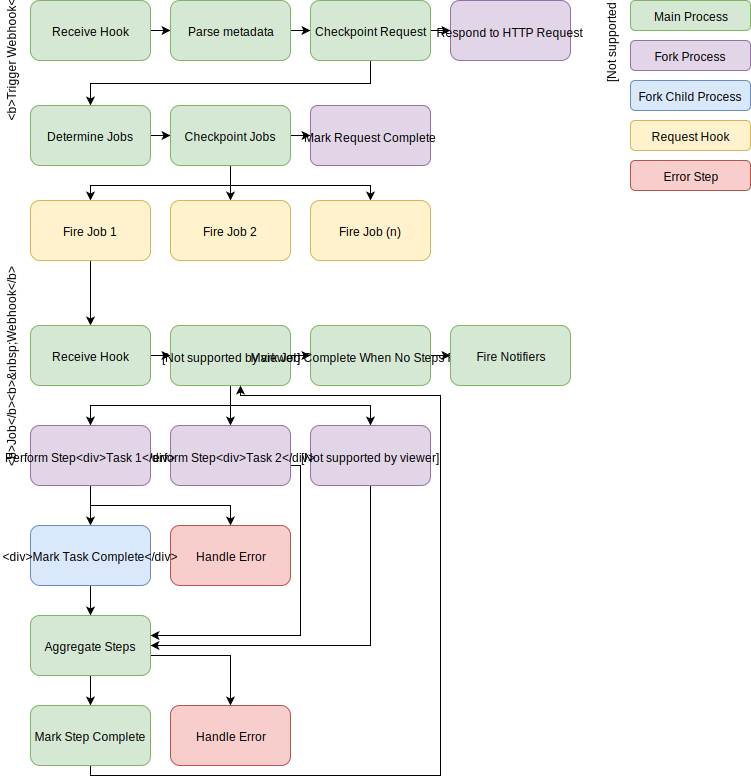

# Architecture #

## Overview ##

Since the tool is designed to interact primarily with Kubernetes, the infrastructure design targets running as pods within Kubernetes.

## Infrastructure ##

Interaction with KubeCI is done over HTTP(S) both internally and externally.  There are [service endpoints](/endpoints/) for clients and workers.  By matching the internal Kubernetes DNS entry (using KubeDNS) and external DNS, the services are able to operate locally for actions while providing client distribution across clusters with no additional setup work.

Each deployment contains one or more pods with a KubeCI server and an Nginx server.  The KubeCI server is proxied through Nginx and provides the core functionality of the KubeCI system.  The Nginx server handles static assets, such as the WebUI and Documentation.

See the diagram below for traffic flow:

## Process Flow ##

Internally, KubeCI makes use of GoRoutines and Webhooks to distribute workloads across different threads and containers.  The call processes are diagrammed below:

